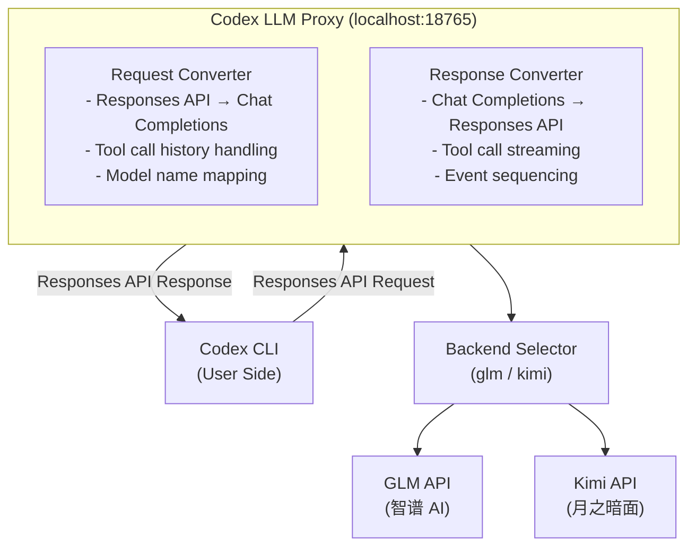

# Codex LLM Proxy

[](https://opensource.org/licenses/MIT)
[](https://www.python.org/downloads/)

**English** | [中文](README_CN.md)

Enable **OpenAI Codex CLI** to work with **multiple LLM providers** by running a local proxy that converts OpenAI Responses API format to Chat Completions format.

Supported providers: **GLM (智谱 AI)** and **Kimi (月之暗面)**.

> **Note:** This project is modified from [https://github.com/JichinX/codex-glm-proxy](https://github.com/JichinX/codex-glm-proxy).

## ✨ Features

- ✅ **Limited Codex Compatibility** - Core features work with OpenAI Codex CLI
- ✅ **Multi-Backend Support** - Switch between GLM and Kimi with a single flag
- ✅ **Streaming Support** - Real-time streaming responses
- ✅ **Tool Calling** - Supports `apply_patch`, `exec`, and other Codex tools
- ✅ **Multi-turn Conversations** - Maintains conversation context
- ✅ **Automatic Model Mapping** - Maps OpenAI model names to provider equivalents
- ✅ **Easy Setup** - Single Python file, no complex dependencies

## 🔄 Architecture



## 🚀 Quick Start

### Prerequisites

- Python 3.8+
- API key for your chosen provider
- [OpenAI Codex CLI](https://github.com/openai/codex) installed

### Installation

1. **Clone the repository**
   ```bash
   git clone https://github.com/realweng/codex-llm-proxy.git
   cd codex-llm-proxy
   ```

2. **Set your API key**
   ```bash
   # For GLM
   export GLM_API_KEY="your_glm_api_key_here"

   # For Kimi
   export KIMI_API_KEY="your_kimi_api_key_here"
   ```

3. **Start the proxy**
   ```bash
   # Use GLM backend (default)
   ./scripts/start.sh

   # Use Kimi backend
   ./scripts/start.sh -p kimi
   ```

   Proxy will run on `http://localhost:18765`

4. **Configure Codex CLI**

   Create or update `~/.codex/config.toml`:

   **For GLM:**
   ```toml
   model_provider = "glm-proxy"
   model = "gpt-4o"

   [model_providers.glm-proxy]
   name = "GLM via Proxy"
   base_url = "http://localhost:18765/v4"
   wire_api = "responses"
   ```

   **For Kimi:**
   ```toml
   model_provider = "kimi-proxy"
   model = "gpt-4o"

   [model_providers.kimi-proxy]
   name = "Kimi via Proxy"
   base_url = "http://localhost:18765/v4"
   wire_api = "responses"
   ```

5. **Test it!**
   ```bash
   mkdir test-codex && cd test-codex && git init
   codex exec "Create a Python hello world program" --full-auto
   ```

## 📋 Configuration

### Environment Variables

| Variable | Default | Description |
|----------|---------|-------------|
| `BACKEND` | `glm` | Backend provider: `glm` or `kimi` |
| `GLM_API_KEY` | *(required for glm)* | Your GLM API key |
| `GLM_API_BASE` | `https://open.bigmodel.cn/api/coding/paas/v4` | GLM API endpoint |
| `KIMI_API_KEY` | *(required for kimi)* | Your Kimi API key |
| `KIMI_API_BASE` | `https://api.kimi.com/coding` | Kimi API endpoint |
| `PROXY_PORT` | `18765` | Local proxy port |

### Script Usage

```bash
./scripts/start.sh [-p <glm|kimi>]

# Examples:
./scripts/start.sh              # Default: GLM backend
./scripts/start.sh -p glm       # Use GLM backend
./scripts/start.sh -p kimi      # Use Kimi backend
```

## 🗺️ Model Mapping

### GLM Backend

| OpenAI Model | GLM Model | Notes |
|--------------|-----------|-------|
| `gpt-4` | `glm-4` | Standard GPT-4 |
| `gpt-4-turbo` | `glm-4` | GPT-4 Turbo |
| `gpt-4o` | `glm-5` | **Recommended** for best coding |
| `gpt-4o-mini` | `glm-4-flash` | Faster, cheaper |
| `gpt-3.5-turbo` | `glm-4-flash` | Legacy support |
| `gpt-5.x-codex` | `glm-5` | Future Codex models |

### Kimi Backend

| OpenAI Model | Kimi Model | Notes |
|--------------|------------|-------|
| `gpt-4` | `kimi-for-coding` | |
| `gpt-4-turbo` | `kimi-for-coding` | |
| `gpt-4o` | `kimi-for-coding` | **Recommended** |
| `gpt-4o-mini` | `kimi-for-coding` | |
| `gpt-3.5-turbo` | `kimi-for-coding` | Legacy support |
| `gpt-5.x-codex` | `kimi-for-coding` | Future Codex models |

**Recommendation:** Use `model = "gpt-4o"` in your Codex config for best results.

## 🔧 Management

```bash
# Start proxy with GLM backend
./scripts/start.sh -p glm

# Start proxy with Kimi backend
./scripts/start.sh -p kimi

# Check if running
curl http://localhost:18765/health

# View logs
tail -f /tmp/codex-llm-proxy.log

# Stop proxy
./scripts/stop.sh
```

## 📝 Example Usage

```bash
# Simple task
codex exec "Create a Python function to calculate Fibonacci" --full-auto

# More complex project
codex exec "Build a REST API with FastAPI for todo management" --full-auto

# With tests
codex exec "Create a calculator module with unit tests" --full-auto
```

## 🐛 Troubleshooting

### "Streaming complete, sent 0 chunks"
**Cause:** Model name not properly mapped
**Solution:** Ensure you're using a known model like `gpt-4o` in config

### Codex loops / repeats actions
**Cause:** Tool call history not properly handled
**Solution:** Update to latest version of proxy

### 502 Bad Gateway
**Cause:** Proxy crashed
**Solution:** Check logs at `/tmp/codex-llm-proxy.log` and restart

### Connection refused
**Cause:** Proxy not running
**Solution:** Start proxy with `./scripts/start.sh`

## 🤝 Contributing

Contributions are welcome! Please feel free to submit a Pull Request.

## 📄 License

This project is licensed under the MIT License - see the [LICENSE](LICENSE) file for details.

## 🙏 Acknowledgments

- [OpenAI Codex](https://github.com/openai/codex) - The amazing coding agent
- [智谱 AI GLM](https://open.bigmodel.cn/) - Powerful Chinese LLM
- [月之暗面 Kimi](https://kimi.moonshot.cn/) - Powerful coding model
- [codex-glm-proxy](https://github.com/JichinX/codex-glm-proxy) - The original GLM proxy project that inspired this work

## 📊 Project Status

⚠️ **Beta** - Core features tested; edge cases may not work

| Feature | Status |
|---------|--------|
| Text conversations | ✅ Working |
| Model mapping | ✅ Working |
| Streaming responses | ✅ Working |
| Tool calling | ✅ Working |
| Multi-turn conversations | ✅ Working |
| Tool call history | ✅ Working |
| Tool call results | ✅ Working |
| Multi-backend (GLM/Kimi) | ✅ Working |

---

**Made with ❤️ by the community, for the community**

**Star ⭐ this repo if you find it useful!**
