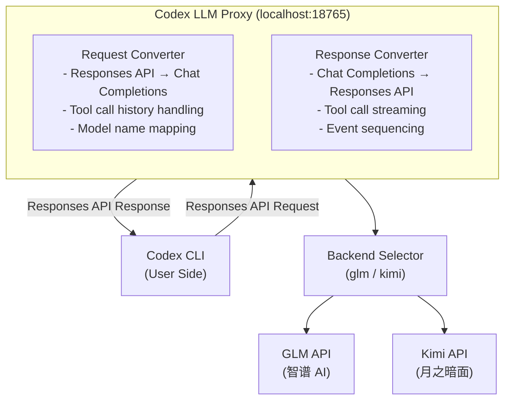

# Codex LLM Proxy

[](https://opensource.org/licenses/MIT)
[](https://www.python.org/downloads/)

**English** | [中文](README_CN.md)

Enable **OpenAI Codex CLI** to work with **multiple LLM providers** by running a local proxy that converts OpenAI Responses API format to Chat Completions format.

Supported providers: **GLM (智谱 AI)** and **Kimi (月之暗面)**.

> **Note:** This project is modified from [https://github.com/JichinX/codex-glm-proxy](https://github.com/JichinX/codex-glm-proxy).

## ✨ Features

- ✅ **Computer Use & Browser Support** - Use Codex CLI's Computer Use and Browser plugins (via MCP tools) through namespace tool flattening
- ✅ **Multi-Backend Support** - Switch between GLM and Kimi with a single flag
- ✅ **Streaming Support** - Real-time streaming responses
- ✅ **Tool Calling** - Supports `apply_patch`, `exec`, and other Codex tools, plus MCP namespace tools
- ✅ **Multi-turn Conversations** - Maintains conversation context
- ✅ **Automatic Model Mapping** - Maps OpenAI model names to provider equivalents
- ✅ **Model List Exposure** - `/models` endpoint returns real backend model names (e.g., `glm-5`, `kimi-for-coding`)
- ✅ **Anonymous Requests** - Strips Codex CLI identity headers; neutral User-Agent
- ✅ **Easy Setup** - Single Python file, no complex dependencies

## 🔄 Architecture



## 🚀 Quick Start

### Prerequisites

- Python 3.8+
- API key for your chosen provider
- [OpenAI Codex CLI](https://github.com/openai/codex) installed

### Installation

1. **Clone the repository**
   ```bash
   git clone https://github.com/realweng/codex-llm-proxy.git
   cd codex-llm-proxy
   ```

2. **Set your API key**
   ```bash
   # For GLM
   export GLM_API_KEY="your_glm_api_key_here"

   # For Kimi
   export KIMI_API_KEY="your_kimi_api_key_here"
   ```

3. **Start the proxy**
   ```bash
   # Use GLM backend (default)
   ./scripts/start.sh

   # Use Kimi backend
   ./scripts/start.sh -p kimi
   ```

   Proxy will run on `http://localhost:18765`

4. **Configure Codex CLI**

   Create or update `~/.codex/config.toml`:

   **For GLM:**
   ```toml
   model_provider = "glm-proxy"
   model = "gpt-4o"

   [model_providers.glm-proxy]
   name = "GLM via Proxy"
   base_url = "http://localhost:18765/v1"
   wire_api = "responses"
   ```

   **For Kimi:**
   ```toml
   model_provider = "kimi-proxy"
   model = "gpt-4o"

   [model_providers.kimi-proxy]
   name = "Kimi via Proxy"
   base_url = "http://localhost:18765/v1"
   wire_api = "responses"
   ```

   > **Note:** We intentionally do NOT set `requires_openai_auth`. The proxy handles authentication directly with the backend provider, keeping Codex CLI requests anonymous.

5. **Test it!**
   ```bash
   mkdir test-codex && cd test-codex && git init
   codex exec "Create a Python hello world program" --full-auto
   ```

## 🔄 Automatic config management

`./scripts/start.sh` doesn't just spin up the HTTP proxy — it also snapshots your existing `~/.codex/config.toml`, generates a model catalog (`~/.codex-llm-proxy/model-catalog.json`) listing the `gpt-5.x` family, and rewrites the config so Codex (both CLI and Desktop App) points its `openai_base_url` and `model_catalog_json` at this proxy. `./scripts/stop.sh` restores the original config from the snapshot.

| Path | Purpose |
|---|---|
| `~/.codex-llm-proxy/codex-config.snapshot.toml` | 1:1 copy of your config at start time (restored on stop) |
| `~/.codex-llm-proxy/model-catalog.json` | Generated model catalog Codex reads via `model_catalog_json` |
| `~/.codex-llm-proxy/applied.txt` | Sentinel — present while the proxy is holding your config |

If `Codex App Transfer.app` is detected running, the rewrite is automatically **skipped** to avoid conflict (you'll see a warning on stderr); the proxy itself still starts. To manually restore at any time:

```bash
python3 scripts/codex_config.py restore
```

## 🖱️ Codex Desktop App enhancement (optional)

Beyond the CLI flow above, this repo also ships [BigPizzaV3/CodexPlusPlus](https://github.com/BigPizzaV3/CodexPlusPlus) as a **git submodule** at `vendor/CodexPlusPlus/` (pinned to `v1.0.5.1`). CodexPlusPlus launches the Codex Desktop App with Chrome DevTools Protocol enabled and injects a renderer script that:

- unlocks the **Plugins** nav entry that is normally disabled in API-Key login mode,
- enables the "Install" buttons in the plugin marketplace,
- adds a session-**delete** button in the sidebar plus a `Codex++` menu in the top bar.

It operates on the Electron renderer's React state and is **independent** of this proxy — they stack but do not interact. Use both for the full experience.

### Setup (one-time)

```bash
# Pull the submodule
git submodule update --init --recursive

# Create vendor/.venv and install CodexPlusPlus into it (Python 3.11+ required)
./scripts/codex-app-setup.sh
```

### Run

```bash
# Terminal 1: keep the proxy running
export GLM_API_KEY=...    # or KIMI_API_KEY
./scripts/start.sh -p glm

# Terminal 2: launch Codex Desktop with injection
export OPENAI_BASE_URL=http://localhost:18765/v1   # see note below
./scripts/codex-app.sh
```

> **Base-URL note.** CodexPlusPlus does **not** wire Codex Desktop App's OpenAI endpoint to this proxy. Whether `OPENAI_BASE_URL` / `OPENAI_API_BASE` are honored depends on the Codex Desktop App build; otherwise configure the custom base URL inside Codex App's own settings. If neither works on your build, the integration still gives you the Plugins UI unlock and session-delete — Desktop App's LLM traffic just won't flow through the proxy.

> **License note.** CodexPlusPlus upstream has no LICENSE file. This repo references it as a submodule pointer only (never redistributing its source). All use is under upstream's terms; see `vendor/CodexPlusPlus/README.md` and the upstream link above.

> **Platform note.** Upstream supports macOS and Windows only; Linux is not supported.

## 🖥️ Computer Use & Browser Support

This proxy supports Codex CLI's **Computer Use** and **Browser** plugins by transparently handling MCP tools:

- **Namespace tool flattening** — Codex CLI wraps MCP tools (browser, computer-use, etc.) in `type: "namespace"` containers. The proxy recursively flattens them into standard `function` tools so the backend LLM can see and invoke them.
- **Namespace restoration** — When the backend returns a tool call, the proxy restores the original tool name and `namespace` field so Codex CLI can correctly route the call to the corresponding MCP server.
- **Placeholder handling** — Historical `computer_call`, `code_interpreter_call`, etc. items in conversation history are converted to placeholder messages to keep context coherent.

### Enable Computer Use in Codex CLI

1. Enable the plugins in your Codex CLI config (`~/.codex/config.toml`):
   ```toml
   [plugins."computer-use@openai-bundled"]
   enabled = true

   [plugins."browser-use@openai-bundled"]
   enabled = true

   [plugins."chrome@openai-bundled"]
   enabled = true
   ```

2. Set sandbox mode to full access:
   ```toml
   sandbox_mode = "danger-full-access"
   ```

3. Now you can ask Codex to use Chrome or Computer Use:
   ```bash
   codex exec "Open Chrome and search for today's news"
   ```

## 📋 Configuration

### Environment Variables

| Variable | Default | Description |
|----------|---------|-------------|
| `BACKEND` | `glm` | Backend provider: `glm` or `kimi` |
| `GLM_API_KEY` | *(required for glm)* | Your GLM API key |
| `GLM_API_BASE` | `https://open.bigmodel.cn/api/coding/paas/v4` | GLM API endpoint |
| `KIMI_API_KEY` | *(required for kimi)* | Your Kimi API key |
| `KIMI_API_BASE` | `https://api.kimi.com/coding` | Kimi API endpoint |
| `PROXY_PORT` | `18765` | Local proxy port |

### Script Usage

```bash
./scripts/start.sh [-p <glm|kimi>]

# Examples:
./scripts/start.sh              # Default: GLM backend
./scripts/start.sh -p glm       # Use GLM backend
./scripts/start.sh -p kimi      # Use Kimi backend
```

## 🗺️ Model Mapping

### GLM Backend

| OpenAI / Codex Model | GLM Model | Notes |
|----------------------|-----------|-------|
| `gpt-5.4` / `gpt-5.5` / `gpt-5.4-mini` | `glm-5.1` | **Recommended** — Codex Desktop App default family |
| `gpt-5.3-codex` / `gpt-5.2` / `gpt-5.2-codex` | `glm-5.1` | Older Codex model variants |
| `gpt-4o` | `glm-5.1` | Good default for Codex CLI |
| `gpt-4` / `gpt-4-turbo` | `glm-4` | Legacy GPT-4 family |
| `gpt-4o-mini` / `gpt-3.5-turbo` | `glm-4-flash` | Faster, cheaper |

### Kimi Backend

| OpenAI / Codex Model | Kimi Model | Notes |
|----------------------|------------|-------|
| `gpt-5.4` / `gpt-5.5` / `gpt-5.4-mini` | `kimi-for-coding` | **Recommended** — Codex Desktop App default family |
| `gpt-5.3-codex` / `gpt-5.2` / `gpt-5.2-codex` | `kimi-for-coding` | Older Codex model variants |
| `gpt-4` / `gpt-4-turbo` / `gpt-4o` / `gpt-4o-mini` / `gpt-3.5-turbo` | `kimi-for-coding` | All map to the same coding model |

**Recommendation:** Use `model = "gpt-5.4"` in your Codex config — it matches what Codex Desktop App selects by default and what `codex-app-transfer`'s built-in model catalog routes through.

## 🔧 Management

```bash
# Start proxy with GLM backend
./scripts/start.sh -p glm

# Start proxy with Kimi backend
./scripts/start.sh -p kimi

# Check if running
curl http://localhost:18765/health

# View logs
tail -f /tmp/codex-llm-proxy.log

# Stop proxy
./scripts/stop.sh
```

## 📝 Example Usage

```bash
# Simple task
codex exec "Create a Python function to calculate Fibonacci" --full-auto

# More complex project
codex exec "Build a REST API with FastAPI for todo management" --full-auto

# With tests
codex exec "Create a calculator module with unit tests" --full-auto
```

## 🐛 Troubleshooting

### "Streaming complete, sent 0 chunks"
**Cause:** Model name not properly mapped
**Solution:** Ensure you're using a known model like `gpt-4o` in config

### Codex loops / repeats actions
**Cause:** Tool call history not properly handled
**Solution:** Update to latest version of proxy

### 502 Bad Gateway
**Cause:** Proxy crashed
**Solution:** Check logs at `/tmp/codex-llm-proxy.log` and restart

### Connection refused
**Cause:** Proxy not running
**Solution:** Start proxy with `./scripts/start.sh`

## 🤝 Contributing

Contributions are welcome! Please feel free to submit a Pull Request.

## 📄 License

This project is licensed under the MIT License - see the [LICENSE](LICENSE) file for details.

## 🙏 Acknowledgments

- [OpenAI Codex](https://github.com/openai/codex) - The amazing coding agent
- [智谱 AI GLM](https://open.bigmodel.cn/) - Powerful Chinese LLM
- [月之暗面 Kimi](https://kimi.moonshot.cn/) - Powerful coding model
- [codex-glm-proxy](https://github.com/JichinX/codex-glm-proxy) - The original GLM proxy project that inspired this work

## 📊 Project Status

⚠️ **Beta** - Core features tested; edge cases may not work

| Feature | Status |
|---------|--------|
| Text conversations | ✅ Working |
| Model mapping | ✅ Working |
| Streaming responses | ✅ Working |
| Tool calling | ✅ Working |
| Multi-turn conversations | ✅ Working |
| Tool call history | ✅ Working |
| Tool call results | ✅ Working |
| Multi-backend (GLM/Kimi) | ✅ Working |
| MCP namespace tools | ✅ Working |
| Computer Use / Browser | ✅ Working |
| Anonymous requests | ✅ Working |
| Real model names in /models | ✅ Working |

---

**Made with ❤️ by the community, for the community**

**Star ⭐ this repo if you find it useful!**
