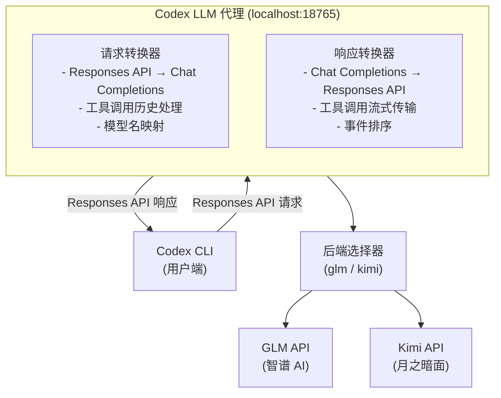

# Codex LLM 代理

[](https://opensource.org/licenses/MIT)
[](https://www.python.org/downloads/)

[English](README.md) | **中文**

让 **OpenAI Codex CLI** 能够使用**多种国产大模型**，通过本地代理将 OpenAI Responses API 格式转换为 Chat Completions 格式。

已支持供应商：**GLM（智谱 AI）** 和 **Kimi（月之暗面）**。

> **说明：** 本项目修改自 [https://github.com/JichinX/codex-glm-proxy](https://github.com/JichinX/codex-glm-proxy)。

## ✨ 特性

- ✅ **Computer Use & 浏览器支持** - 通过 namespace 工具展平支持 Codex CLI 的 Computer Use 和 Browser 插件（MCP 工具）
- ✅ **多后端支持** - 一个参数即可切换 GLM 和 Kimi
- ✅ **流式响应支持** - 实时流式响应
- ✅ **工具调用** - 支持 `apply_patch`、`exec` 等 Codex 工具，以及 MCP namespace 工具
- ✅ **多轮对话** - 保持对话上下文
- ✅ **自动模型映射** - 自动将 OpenAI 模型名映射到供应商对应版本
- ✅ **模型列表暴露** - `/models` 端点返回真实后端模型名（如 `glm-5`、`kimi-for-coding`）
- ✅ **匿名化请求** - 剥离 Codex CLI 身份头，使用中性 User-Agent
- ✅ **简单配置** - 单个 Python 文件，无需复杂依赖

## 🔄 架构



## 🚀 快速开始

### 前置要求

- Python 3.8+
- 所选供应商的 API 密钥
- 已安装 [OpenAI Codex CLI](https://github.com/openai/codex)

### 安装步骤

1. **克隆仓库**
   ```bash
   git clone https://github.com/realweng/codex-llm-proxy.git
   cd codex-llm-proxy
   ```

2. **设置 API 密钥**

   **macOS / Linux:**
   ```bash
   # GLM
   export GLM_API_KEY="你的_GLM_API_密钥"

   # Kimi
   export KIMI_API_KEY="你的_Kimi_API_密钥"
   ```

   **Windows (CMD):**
   ```cmd
   # GLM
   set GLM_API_KEY=你的_GLM_API_密钥

   # Kimi
   set KIMI_API_KEY=你的_Kimi_API_密钥
   ```

3. **启动代理**

   **macOS / Linux:**
   ```bash
   # 使用 GLM 后端（默认）
   ./scripts/start.sh

   # 使用 Kimi 后端
   ./scripts/start.sh -p kimi
   ```

   **Windows:**
   ```cmd
   # 使用 GLM 后端（默认）
   scripts\start.bat

   # 使用 Kimi 后端
   scripts\start.bat -p kimi
   ```

   代理将运行在 `http://localhost:18765`

4. **配置 Codex CLI**

   创建或更新 `~/.codex/config.toml`：

   **GLM 配置：**
   ```toml
   model_provider = "glm-proxy"
   model = "gpt-4o"

   [model_providers.glm-proxy]
   name = "GLM via Proxy"
   base_url = "http://localhost:18765/v1"
   wire_api = "responses"
   ```

   **Kimi 配置：**
   ```toml
   model_provider = "kimi-proxy"
   model = "gpt-4o"

   [model_providers.kimi-proxy]
   name = "Kimi via Proxy"
   base_url = "http://localhost:18765/v1"
   wire_api = "responses"
   ```

   > **注意：** 我们有意不设置 `requires_openai_auth`。代理直接与后端供应商处理认证，保持 Codex CLI 请求匿名化。

5. **测试**
   ```bash
   mkdir test-codex && cd test-codex && git init
   codex exec "创建一个 Python hello world 程序" --full-auto
   ```

## 🔄 自动接管 Codex 配置

`./scripts/start.sh` 不只是启动 HTTP 代理 —— 它会先 snapshot 你当前的 `~/.codex/config.toml`，根据所选 backend 生成一份 model catalog（`~/.codex-llm-proxy/model-catalog.json`，列出 `gpt-5.x` 模型族），然后改写 config.toml 让 Codex（CLI 和 Desktop App）把 `openai_base_url` 和 `model_catalog_json` 都指向本代理。`./scripts/stop.sh` 会从 snapshot 还原。

| 路径 | 作用 |
|---|---|
| `~/.codex-llm-proxy/codex-config.snapshot.toml` | start 时的 config.toml 1:1 拷贝（stop 时还原） |
| `~/.codex-llm-proxy/model-catalog.json` | 自动生成的 model catalog，被 Codex 通过 `model_catalog_json` 读取 |
| `~/.codex-llm-proxy/applied.txt` | sentinel —— 代理正在占用 config 时存在 |

如果检测到 `Codex App Transfer.app` 已经在运行，会**自动跳过**改写避免冲突（stderr 给警告），代理本身仍然会起来。需要手动还原时：

**macOS / Linux:**
```bash
python3 scripts/codex_config.py restore
```

**Windows:**
```cmd
python scripts\codex_config.py restore
```

## 🖱️ Codex 桌面应用增强（可选）

除了上面的 CLI 流程，本仓库还把 [BigPizzaV3/CodexPlusPlus](https://github.com/BigPizzaV3/CodexPlusPlus) 作为 **git submodule** 引入 `vendor/CodexPlusPlus/`（钉在 `v1.0.5.1`）。CodexPlusPlus 启动 Codex Desktop App 时开启 Chrome DevTools Protocol，并向渲染进程注入脚本，作用：

- 解锁 API Key 登录模式下被禁用的左侧 **「插件」** 入口；
- 启用插件市场的 **「安装」** 按钮；
- 在会话列表悬停时显示 **「删除」** 按钮，顶部菜单栏增加 `Codex++` 菜单。

它操作的是 Electron 渲染端的 React 状态，跟本代理是**两个独立层**，可以叠加但不互相依赖。同时启用两者可以获得完整体验。

### 一次性安装

```bash
# 拉取 submodule 源码
git submodule update --init --recursive

# 创建 vendor/.venv 并安装 CodexPlusPlus（需要 Python 3.11+）
./scripts/codex-app-setup.sh
```

### 运行

```bash
# 终端 1：保持代理运行
export GLM_API_KEY=...    # 或 KIMI_API_KEY
./scripts/start.sh -p glm

# 终端 2：启动 Codex Desktop 并注入
export OPENAI_BASE_URL=http://localhost:18765/v1   # 见下方说明
./scripts/codex-app.sh
```

> **base URL 说明。** CodexPlusPlus **不会**把 Codex Desktop App 的 OpenAI 端点指到本代理。`OPENAI_BASE_URL` / `OPENAI_API_BASE` 是否被读取取决于具体的 Codex Desktop App 构建；如果不读，请在 Codex App 自己的设置里配置自定义 base URL。即使路由没生效，"插件 UI 解锁 + 会话删除"功能仍可用，只是 Desktop App 的 LLM 流量不会走代理。

> **License 说明。** CodexPlusPlus 上游仓库没有 LICENSE 文件。本仓库仅以 submodule 指针引用，不再分发其源码；所有使用受上游条款约束，详见 `vendor/CodexPlusPlus/README.md` 和上方上游链接。

> **平台说明。** 上游仅支持 macOS 和 Windows，不支持 Linux。

## 🖥️ Computer Use & 浏览器支持

本代理通过透明处理 MCP 工具支持 Codex CLI 的 **Computer Use** 和 **浏览器** 插件：

- **Namespace 工具展平** — Codex CLI 将 MCP 工具（浏览器、computer-use 等）包装在 `type: "namespace"` 容器中。代理递归展平为标准 `function` 工具，使后端 LLM 能够看到并调用它们。
- **Namespace 还原** — 当后端返回工具调用时，代理还原原始工具名和 `namespace` 字段，使 Codex CLI 能正确路由到对应的 MCP 服务器。
- **占位符处理** — 对话历史中的 `computer_call`、`code_interpreter_call` 等条目被转换为占位消息，保持上下文连贯。

### 在 Codex CLI 中启用 Computer Use

1. 在 Codex CLI 配置（`~/.codex/config.toml`）中启用插件：
   ```toml
   [plugins."computer-use@openai-bundled"]
   enabled = true

   [plugins."browser-use@openai-bundled"]
   enabled = true

   [plugins."chrome@openai-bundled"]
   enabled = true
   ```

2. 设置沙箱模式为完全访问：
   ```toml
   sandbox_mode = "danger-full-access"
   ```

3. 现在可以让 Codex 使用 Chrome 或 Computer Use：
   ```bash
   codex exec "打开 Chrome 搜索今天的新闻"
   ```

## 📋 配置说明

### 环境变量

| 环境变量 | 默认值 | 说明 |
|---------|--------|------|
| `BACKEND` | `glm` | 后端供应商：`glm` 或 `kimi` |
| `GLM_API_KEY` | *(glm 必需)* | 你的 GLM API 密钥 |
| `GLM_API_BASE` | `https://open.bigmodel.cn/api/coding/paas/v4` | GLM API 端点 |
| `KIMI_API_KEY` | *(kimi 必需)* | 你的 Kimi API 密钥 |
| `KIMI_API_BASE` | `https://api.kimi.com/coding` | Kimi API 端点 |
| `PROXY_PORT` | `18765` | 本地代理端口 |

### 启动脚本用法

**macOS / Linux:**
```bash
./scripts/start.sh [-p <glm|kimi>]

# 示例：
./scripts/start.sh              # 默认使用 GLM 后端
./scripts/start.sh -p glm       # 使用 GLM 后端
./scripts/start.sh -p kimi      # 使用 Kimi 后端
```

**Windows:**
```cmd
scripts\start.bat [-p <glm|kimi>]

# 示例：
scripts\start.bat              # 默认使用 GLM 后端
scripts\start.bat -p glm       # 使用 GLM 后端
scripts\start.bat -p kimi      # 使用 Kimi 后端
```

## 🗺️ 模型映射

### GLM 后端

| OpenAI / Codex 模型 | GLM 模型 | 说明 |
|---------------------|----------|------|
| `gpt-5.4` / `gpt-5.5` / `gpt-5.4-mini` | `glm-5.1` | **推荐** —— Codex Desktop App 默认模型族 |
| `gpt-5.3-codex` / `gpt-5.2` / `gpt-5.2-codex` | `glm-5.1` | 旧版 Codex 模型 |
| `gpt-4o` | `glm-5.1` | Codex CLI 推荐 |
| `gpt-4` / `gpt-4-turbo` | `glm-4` | 旧版 GPT-4 系列 |
| `gpt-4o-mini` / `gpt-3.5-turbo` | `glm-4-flash` | 更快、更便宜 |

### Kimi 后端

| OpenAI / Codex 模型 | Kimi 模型 | 说明 |
|---------------------|-----------|------|
| `gpt-5.4` / `gpt-5.5` / `gpt-5.4-mini` | `kimi-for-coding` | **推荐** —— Codex Desktop App 默认模型族 |
| `gpt-5.3-codex` / `gpt-5.2` / `gpt-5.2-codex` | `kimi-for-coding` | 旧版 Codex 模型 |
| `gpt-4` / `gpt-4-turbo` / `gpt-4o` / `gpt-4o-mini` / `gpt-3.5-turbo` | `kimi-for-coding` | 统一映射到同一个编码模型 |

**建议：** 在 Codex 配置中使用 `model = "gpt-5.4"` —— 跟 Codex Desktop App 默认选择和 `codex-app-transfer` 内置 model catalog 的路由保持一致。

## 🔧 管理命令

**macOS / Linux:**
```bash
# 使用 GLM 后端启动
./scripts/start.sh -p glm

# 使用 Kimi 后端启动
./scripts/start.sh -p kimi

# 检查是否运行
curl http://localhost:18765/health

# 查看日志
tail -f /tmp/codex-llm-proxy.log

# 停止代理
./scripts/stop.sh
```

**Windows:**
```cmd
# 使用 GLM 后端启动
scripts\start.bat -p glm

# 使用 Kimi 后端启动
scripts\start.bat -p kimi

# 检查是否运行
curl http://localhost:18765/health

# 查看日志
type %TEMP%\codex-llm-proxy.log

# 停止代理
scripts\stop.bat
```

## 📝 使用示例

```bash
# 简单任务
codex exec "创建一个计算斐波那契数列的 Python 函数" --full-auto

# 更复杂的项目
codex exec "用 FastAPI 构建一个待办事项管理的 REST API" --full-auto

# 包含测试
codex exec "创建一个计算器模块并编写单元测试" --full-auto
```

## 🐛 故障排除

### "Streaming complete, sent 0 chunks"
**原因：** 模型名未正确映射
**解决：** 确保配置中使用已知模型如 `gpt-4o`

### Codex 循环/重复操作
**原因：** 工具调用历史未正确处理
**解决：** 更新到最新版本的代理

### 502 Bad Gateway
**原因：** 代理崩溃
**解决：** 检查日志 `/tmp/codex-llm-proxy.log`（macOS/Linux）或 `%TEMP%\codex-llm-proxy.log`（Windows）并重启

### Connection refused
**原因：** 代理未运行
**解决：** 使用 `./scripts/start.sh` 启动代理

## 🤝 贡献

欢迎贡献！请随时提交 Pull Request。

## 📄 许可证

本项目采用 MIT 许可证 - 详情见 [LICENSE](LICENSE) 文件。

## 🙏 致谢

- [OpenAI Codex](https://github.com/openai/codex) - 强大的编程助手
- [智谱 AI GLM](https://open.bigmodel.cn/) - 强大的国产大模型
- [月之暗面 Kimi](https://kimi.moonshot.cn/) - 强大的编程模型
- [codex-glm-proxy](https://github.com/JichinX/codex-glm-proxy) - 启发了本项目的原始 GLM 代理项目

## 📊 项目状态

⚠️ **Beta** - 核心功能已测试；边界情况可能不工作

| 功能 | 状态 |
|------|------|
| 文本对话 | ✅ 正常 |
| 模型映射 | ✅ 正常 |
| 流式响应 | ✅ 正常 |
| 工具调用 | ✅ 正常 |
| 多轮对话 | ✅ 正常 |
| 工具调用历史 | ✅ 正常 |
| 工具调用结果 | ✅ 正常 |
| 多后端 (GLM/Kimi) | ✅ 正常 |
| MCP namespace 工具 | ✅ 正常 |
| Computer Use / 浏览器 | ✅ 正常 |
| 匿名化请求 | ✅ 正常 |
| /models 返回真实模型名 | ✅ 正常 |

---

**用 ❤️ 打造，服务社区**

**觉得有用请点个 Star ⭐**
